# Employee Tracker

## GitHub Repository & Walkthrough Video Application
* https://github.com/ila0406/Employee-Tracker
* [Walkthrough Video](https://drive.google.com/drive/u/0/folders/1UI2KWncr4erHyD7Q0AjsXeY8JMkQF5vH)
* [Walkthrough Viedo - Loom](https://www.loom.com/share/22fbf106ad274bd8930dba5eff2fbc0a)

## 
* [Description](#description)
* [Technolgies Used](#technolgies-used)
* [Installation Instructions](#installation-instructions)
* [Usage Info](#usage-info)
* [Contribution Guide](#contribution-guide)
* [Instructions for testing](#instructions-for-testing)
* [Questions](#questions)
* [Screenshots](#screenshots) 

## 
Developers frequently have to create interfaces that allow non-developers to easily view and interact with information stored in databases. These interfaces are called CMS. This is a command-line application to manage a company's employee database, using Node.js, Inquirer, and MySQL

## Main Menu Commands
01) View All Employees
02) Add Employee
03) Remove Employee
04) Update Employee Role
05) Update Employee Manager
06) Update Employee Department
07) View All Roles
08) Add Role
09) Remove Role
10) View all Departments
11) Add Department
12) Remove Department
13) View All Employees By Department
14) View All Employees by Manager
15) Quit

## 
* Javascript 
* Node.js 
* Inquirer 
* MySQL 
* console.table

## 
1) Run > `npm i` to install node packages
2) Run mysql commands to create and seed databases
3) Run > `npm start` to begin program

## 
Once Installed 
1) Navigate to db folder in terminal 
2) login to mysql with `mysql -u root -p` 
3) run `SOURCE schema.sql `
4) Run `source seeds.sql` 
5) `quit` mysql 
6) run `npm start`

## 
* DU Instructors and TAs

## 

### Main menu (options 1-14)
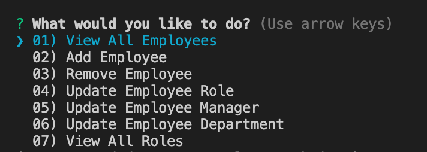
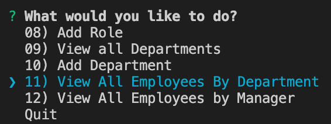

### Output from prompts
01) View All Employees

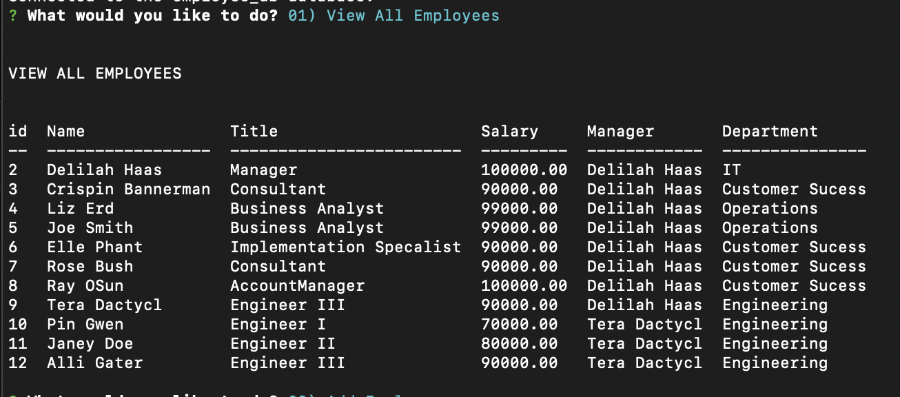

02) Add Employee

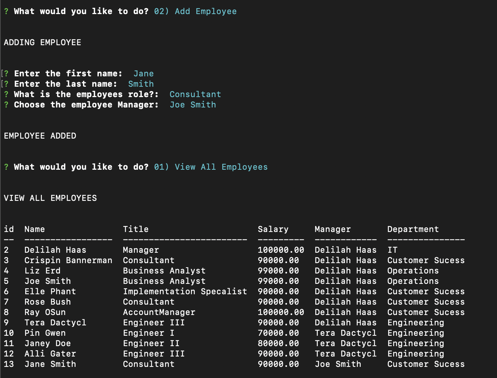

03) Remove Employee

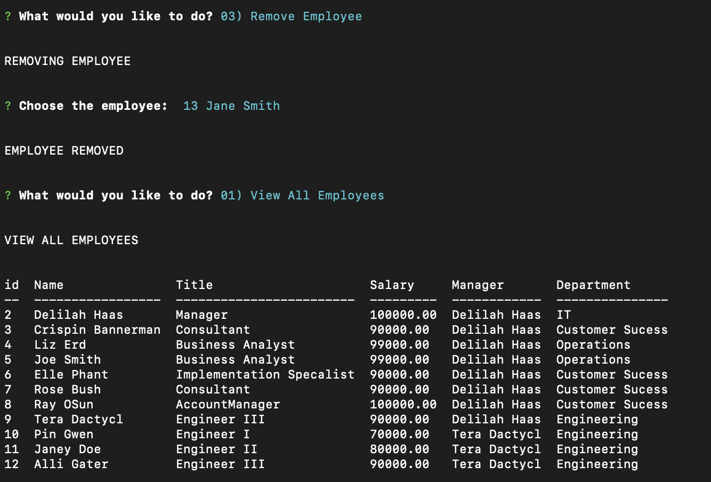

04) Update Employee Role
05) Update Employee Manager
06) Update Employee Department

07) View all Roles

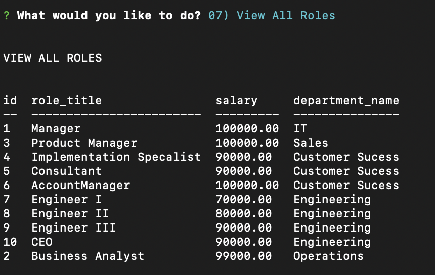

08) Add Role

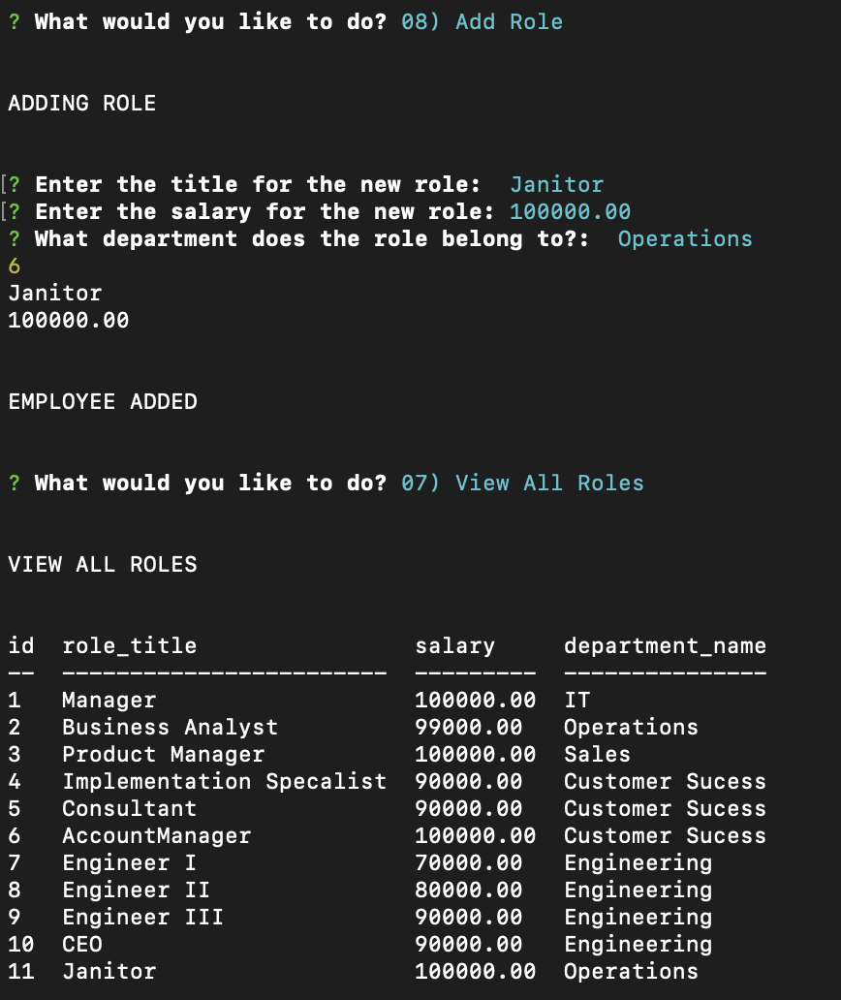

09) Remove Role

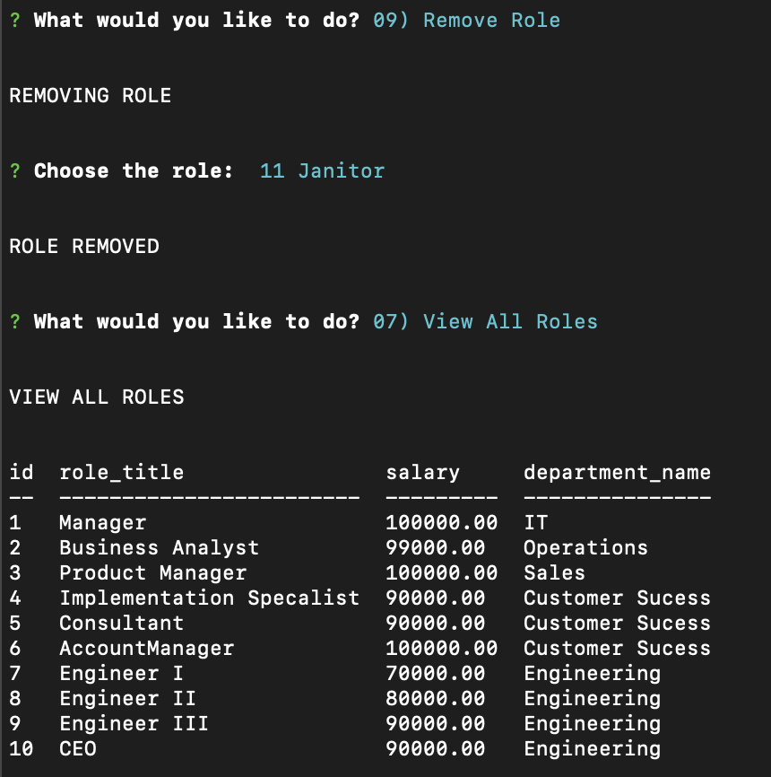

10) View all Departments

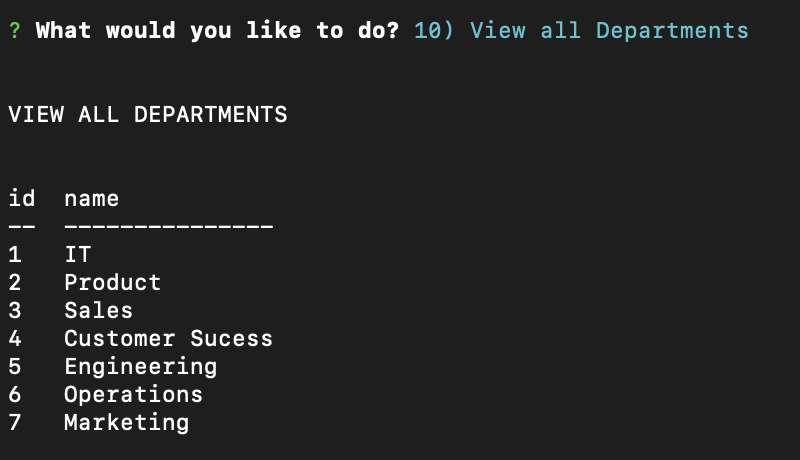

11) Add Department

12) Remove Department

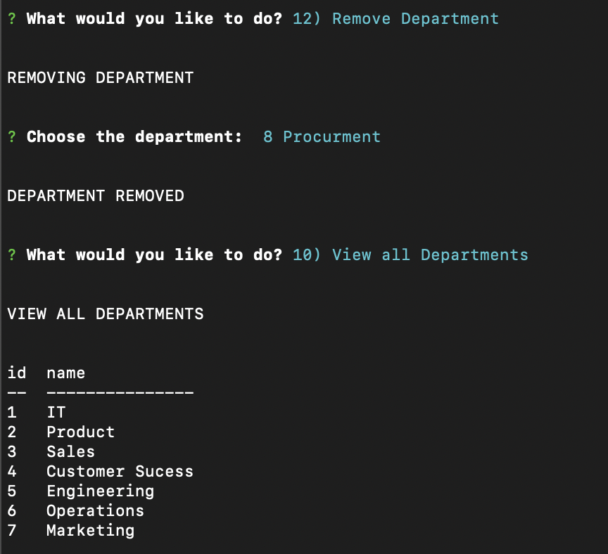

13) View All Employees By Department

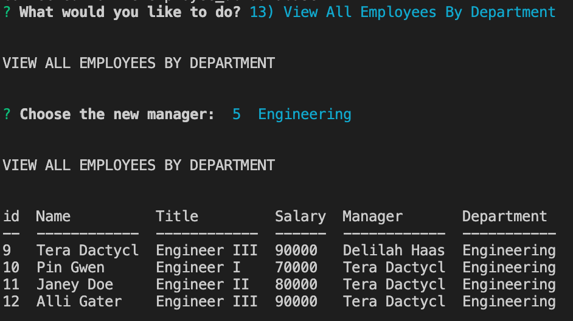

14) View All Employees by Manager

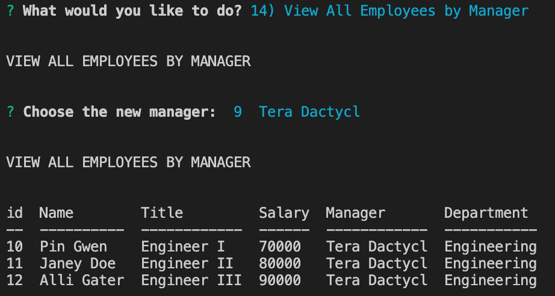

## 
If you have questions, you can either open a issue in my Github repository  
GitHub: <https://github.com/ila0406>  
 
Or you can send me an email directly  
Email: <ila0406@gmail.com>